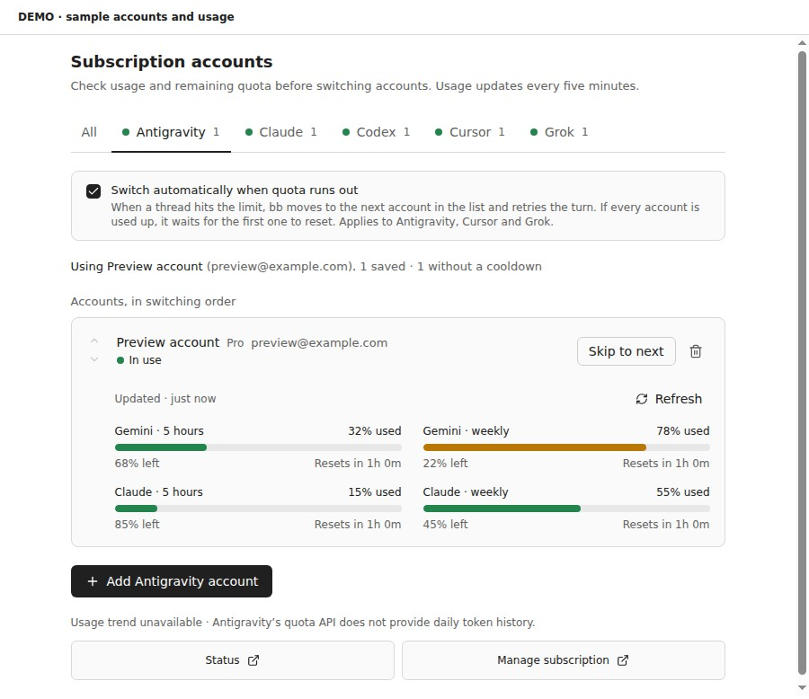
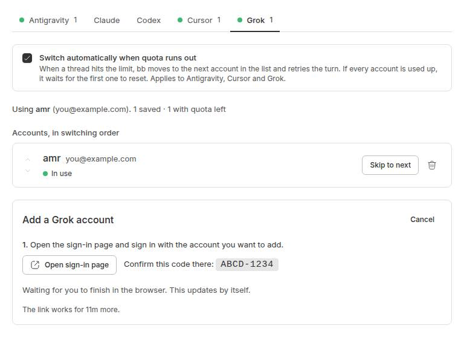

# Subscription Accounts for bb

Stack several logins for each AI subscription you use in [bb](https://getbb.app)
(Antigravity, Claude, Codex, Cursor, Grok). When one account runs out of quota,
bb moves to the next one and carries on with the task.



## What it does

- **One page for every subscription.** Adds a **Subscription Accounts** page
  to the bb sidebar, with a tab per provider. Each tab shows which account is
  in use, which ones are out of quota, and when they come back.
- **Usage and quota beside each account.** Shows used and remaining allowance,
  reset countdowns, plan names and credit balances when the provider reports
  them. Refresh an account manually or let its usage update every five minutes.
  Failed requests keep the last successful reading, labeled as last known usage.
- **All subscriptions together.** The **All** tab combines cost, tokens and events
  for Today, Yesterday or 30 Days. A provider donut, daily trend and exact daily
  totals show where usage comes from. Current quotas remain per account below.
  Refresh all sources together, or open a provider from the legend. Shared CLI
  history is counted once per provider; Cursor exports are summed across saved
  accounts. Missing history, partial scans and API estimates are labeled.
- **Usage history.** Daily token trends with 7/30-day views, Today/Yesterday/30-day
  totals, and model breakdowns. Claude, Codex and Grok history comes from this
  machine's CLI records across all logins; Cursor uses each account's usage export.
  Missing costs are estimated from input, output and cache tokens at current API
  prices, marked with `~`. Reported costs are preserved; unpriced models are shown
  separately and excluded from spend and token totals, matching OpenUsage.
  These are API-equivalent costs, not subscription charges.
  Prices refresh hourly from LiteLLM, models.dev and the
  [OpenUsage supplement](https://github.com/robinebers/openusage), with an offline snapshot.
  History scans all matching CLI files on the first refresh, reusing per-file
  parsed usage across refreshes and restarts. It follows OpenUsage’s discovery,
  streaming and deduplication rules; see [history behavior](docs/history.md).
  Antigravity's quota API has no daily history.
  Known quota windows also show a steady-pace marker and estimated time to the limit.
- **Switches accounts automatically.** When a thread hits a plan limit, the
  plugin marks that account as used up until its reset time, switches to the
  next account in your list, and retries the turn. You don't have to do
  anything.
- **Waits when everything is used up.** If every account is out, the turn is
  queued and runs again when the first account resets.
- **Adds accounts from the page.** Click **Add account**, sign in on the
  provider's page, and the login is saved. Your current login on the machine
  is never touched or logged out.
- **Lets you manage the list by hand.** Reorder accounts, switch now, skip to
  the next one, clear an out-of-quota mark, or remove an account.



## How each provider is handled

| Provider | How accounts switch | Sign-in on the page |
|---|---|---|
| **Antigravity** (`acp-antigravity`) | This plugin swaps agy's login file | Google link, then paste the code (60s window) |
| **Cursor** (`acp-cursor`) | This plugin swaps Cursor's login file | Cursor link, finish in the browser |
| **Grok** (`acp-grok`) | This plugin swaps Grok's login file | x.ai link plus a device code |
| **Claude Code** | bb's built-in **Account Pooler** | Claude link, then paste the code |
| **Codex** | bb's built-in **Account Pooler** | OpenAI link plus a device code |

**Antigravity, Cursor and Grok** each keep their login in one file on the bb
server machine (`~/.gemini/antigravity-cli/antigravity-oauth-token`,
`~/.config/cursor/auth.json`, `~/.grok/auth.json`). The plugin keeps a saved
copy of that file for each account and swaps the right one in. After a switch
it stops the thread's agent process, so the retried turn starts a new process
that reads the new login.

**Claude Code and Codex** accounts go through bb's built-in Account Pooler.
The pooler sends each request to an account that still has quota, which is
more reliable for these long-running sessions than swapping files. This
plugin gives it the same page: usage bars for the 5-hour and 7-day windows,
reordering, turning accounts on and off, and sign-in. The first time you open
the Claude or Codex tab it offers to turn the pooler on. Turning it on changes
nothing until you add an account.

## Install

Requires bb 0.44 or newer, and the provider CLIs you want to use (`agy`,
`cursor-agent`, `grok`) installed and signed in on the bb server machine.
Antigravity threads also need the
[Antigravity plugin](https://github.com/amrtawfik160/bb-plugin-antigravity).

```sh
bb plugin install git:github.com/amrtawfik160/bb-plugin-subscription-accounts --yes
```

Open **Subscription Accounts** in the sidebar. On each tab, either click
**Save it** to keep the login the machine already uses, or click **Add account**
to sign in another one.

## CLI

The page covers everything. For scripts and agents there is `bb subs`:

```sh
bb subs list [<provider>] [--json]         # every account and its quota state
bb subs add <provider> [<name>]            # save the login the CLI is using now
bb subs add <provider> [<name>] --from <login-file> [--force]
bb subs use <provider> <name>              # switch now
bb subs next <provider>                    # mark the active account used up, switch
bb subs reset <provider> [<name>]          # clear out-of-quota marks
bb subs remove <provider> <name>
```

`<provider>` is `antigravity`, `cursor` or `grok`. Claude and Codex accounts
are managed on the page or with bb's own `bb pool` command.

## Settings

Under **Settings → Plugins → Subscription Accounts**, or with
`bb plugin config subscription-accounts`:

| Setting | Default | Meaning |
|---|---|---|
| `autoSwitch` | `true` | Switch and retry automatically on quota errors (Antigravity, Cursor, Grok) |
| `fallbackCooldownMinutes` | `60` | How long an account counts as used up when the error has no reset time |
| `antigravityOAuthClientId` / `antigravityOAuthClientSecret` | Unset | Protected OAuth client settings for refreshing Antigravity usage access; otherwise refresh the CLI login |

## Usage data

Antigravity shows shared Gemini and Claude pool quotas, with weekly windows
when its API supports them. Cursor shows billing-cycle usage, model allowances,
on-demand spend and credit grants; request-based plans use the dashboard
fallback. Grok shows its unified weekly pool and any pay-as-you-go cap. Claude
and Codex keep their pooler usage displays, and the machine's current login
also shows usage without requiring an import into the pooler.

The adapters were researched from [OpenUsage](https://github.com/robinebers/openusage).
They call each provider directly from the bb server using that account's saved
login. Usage responses are normalized before reaching the page; tokens are
never included. Swap-provider token refreshes are saved without replacing a
newer CLI login. Local Claude/Codex usage reads existing access tokens; run the
CLI to refresh an expired login, or use the pooler's managed accounts.

Usage is a five-minute in-memory cache, separate from switching cooldowns.
A cooldown-free account is not proof of remaining quota. Missing metrics and
failed requests are labeled explicitly; a reset countdown passing does not
silently turn an old reading into a fresh allowance.

The UI keeps BB's host fonts, theme colors and account order so usage stays
beside the account it describes. Meters communicate consumed allowance, with
text for remaining quota and reset times; warning colors signal approaching
limits. The metric grid becomes a single column on narrow screens. Its design
uses ENERGY 1 / RHYTHM 1 / MOTION 1, matching the existing accounts page.

## Security

- Saved logins are stored in the plugin's own SQLite database
  (`<bb data dir>/plugins/subscription-accounts/data.db`). The folder is
  owner-only (`0700`) and the files are `0600`, the same as the CLIs' own
  login files. Logins are never written to `bb.db`, the repo, or logs.
- Sign-in runs the provider's own CLI with a temporary `HOME` under
  `~/.cache/bb-subscription-accounts/`, which is deleted once the login is
  saved or the sign-in is cancelled.
- Claude and Codex credentials are held by bb's Account Pooler, not by this
  plugin.

## Limits

- Swapping works on the machine that runs the bb server, where the CLIs are
  installed.
- All threads of one provider share the active account, so a switch applies
  to every thread's next turn.
- Quota errors are recognised by their text. Antigravity's are matched
  exactly. Cursor and Grok use common wording ("usage limit", "rate limit
  exceeded", "quota exceeded"). If a provider changes its message, the
  automatic switch will not fire until the pattern is updated in
  [`providers.ts`](providers.ts).
- Antigravity's sign-in code is only accepted for 60 seconds, a limit set by
  `agy`. If it runs out, click **Try again** for a new link.

## Development

```sh
npm install
npm test            # vitest
npm run typecheck
bb plugin build .
bb plugin install . --yes     # or: bb plugin reload subscription-accounts
```

| File | Purpose |
|---|---|
| `providers.ts` | Login file location, identity, sign-in command and quota pattern per provider |
| `pool.ts` | Rotation order, reset-time parsing, naming (pure, unit-tested) |
| `login.ts` | Runs a provider CLI's sign-in in a temporary HOME |
| `pooler.ts` | Calls bb's Account Pooler for Claude and Codex |
| `server.ts` | Storage, automatic switching, page RPC, `bb subs` CLI |
| `app.tsx` | The Subscription Accounts page |
| `usage.ts` | Normalized quota metrics, provider mappers and five-minute cache |
| `usage-client.ts` | Server-only provider requests and token refresh |

## License

MIT
